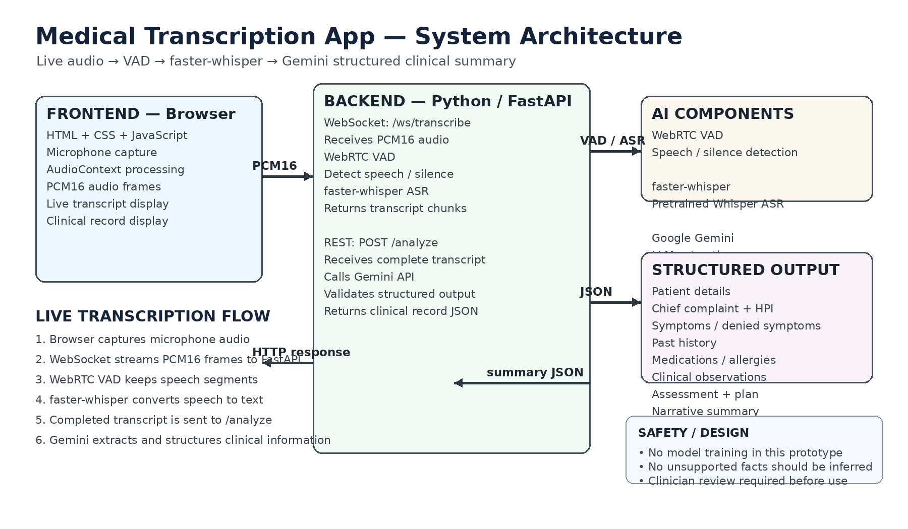

from pathlib import Path

readme = r"""# Medical Transcription App

> **AI-powered medical consultation transcription and clinical summarization**

A lightweight web application that captures a doctor–patient conversation through the browser, detects speech, converts speech to text using **faster-whisper**, and uses **Google Gemini** to turn the completed transcript into a structured clinical record.

## ✨ What it does

- 🎙️ Captures live microphone audio in the browser
- 🔊 Uses **WebRTC VAD** to detect speech and reduce silence/non-speech
- 📝 Transcribes speech with **faster-whisper**
- ⚡ Streams transcript chunks to the browser using **WebSocket**
- 🤖 Sends the completed consultation transcript to **Gemini**
- 📋 Extracts structured clinical information
- 🩺 Displays the result as a medical-record style summary

## 🏗️ System Architecture



### End-to-end flow

```text
Browser Microphone
       │
       │ PCM16 audio over WebSocket
       ▼
FastAPI Backend
       │
       ▼
WebRTC VAD
(Speech / silence detection)
       │
       ▼
faster-whisper
(Speech → Text)
       │
       ├──────────────► Live transcript → Browser
       │
       ▼
Consultation completed
       │
       │ POST /analyze
       ▼
Google Gemini
(Clinical information extraction)
       │
       ▼
Pydantic validation
       │
       ▼
Structured Clinical Record → Browser
🧠 Clinical Information Extracted

The AI is instructed to extract information such as:

Patient details — name, age, sex, identifiers
Chief complaint
History of present illness — onset, duration, progression and related details
Symptoms reported
Symptoms explicitly denied
Past medical history — conditions, surgeries and hospitalisations
Medications — names, dosage and adherence when stated
Allergies
Clinical observations — vitals/examination findings stated in the conversation
Assessment — as stated by the clinician
Plan — investigations, prescriptions, advice and follow-up
Narrative clinical summary

The system is designed to avoid filling missing information with assumptions. Fields that are not mentioned should remain empty/null rather than being invented.

🛠️ Tech Stack
Layer	Technology
Frontend	HTML5, CSS3, JavaScript
Backend	Python, FastAPI
Real-time communication	WebSocket
Speech detection	WebRTC VAD
Speech recognition	faster-whisper
LLM extraction	Google Gemini API
SDK	google-genai
Data validation	Pydantic
Server	Uvicorn
📁 Project Structure
medical-transcription-app/
│
├── backend/
│   ├── asr.py                  # faster-whisper transcription
│   ├── llm_extractor.py        # Gemini clinical extraction
│   ├── main.py                 # FastAPI + WebSocket + REST endpoints
│   ├── requirements.txt        # Python dependencies
│   ├── schemas.py              # Pydantic clinical schemas
│   └── vad_pipeline.py         # WebRTC VAD processing
│
├── frontend/
│   ├── app.js                  # Recording, WebSocket and API logic
│   ├── index.html              # Application interface
│   └── style.css               # UI styling
│
├── docs/
│   └── architecture.png        # System architecture diagram
│
├── .gitignore
└── README.md
🚀 Run Locally
1. Clone the repository
git clone https://github.com/akjvw21/Medical-transcription-app.git
cd Medical-transcription-app
2. Create a Python environment

Windows:

cd backend
python -m venv .venv
.venv\Scripts\activate

macOS/Linux:

cd backend
python -m venv .venv
source .venv/bin/activate
3. Install dependencies
pip install -r requirements.txt
4. Configure Gemini API

Create:

backend/.env

Add your own API key:

GEMINI_API_KEY=your_gemini_api_key_here

Never commit .env or expose the API key in the frontend.

5. Start the backend

From the backend directory:

uvicorn main:app --reload --port 8000

The API will be available at:

http://127.0.0.1:8000

Health check:

http://127.0.0.1:8000/health
6. Start the frontend

Open a second terminal from the project root:

cd frontend
python -m http.server 5500

Then open:

http://127.0.0.1:5500

Allow microphone access when the browser asks for permission.

🔌 API Endpoints
WebSocket — Live transcription
/ws/transcribe

The frontend sends PCM16 audio frames. The backend processes the audio through VAD and faster-whisper and returns transcript chunks.

POST — Clinical analysis
/analyze

Receives the completed transcript and sends it to Gemini for structured clinical information extraction.

GET — Health check
/health

Returns the backend status.

🔐 Safety & Limitations

This is a prototype for demonstration and development purposes.

It does not train an AI model from scratch.
It uses pretrained speech recognition and language models.
Speech recognition may occasionally misrecognize words, especially medical terminology.
The LLM output should not be treated as an autonomous diagnosis.
The application should not invent symptoms, diagnoses, medications or clinical findings that were not stated.
A qualified healthcare professional should review generated notes before they are used in a real medical record.
No real patient data should be used in this demonstration repository.
🎯 Design Approach

The application separates the real-time transcription pipeline from the final clinical summarization step:

During consultation

Audio → VAD → Whisper → Live Transcript

After consultation

Complete Transcript → Gemini → Structured Clinical Record

This keeps the real-time path lightweight while allowing the LLM to analyze the full conversation once the consultation is complete.

🔮 Future Improvements

Potential next steps for a production-oriented version include:

Doctor/patient speaker diarization
Better medical vocabulary handling
Editable transcript before final processing
Consultation history and secure storage
PDF / EMR export
Multi-language support
Authentication and role-based access
Audit logs and stronger privacy controls
Cloud deployment and monitoring
Human review and correction workflow
📌 Project Status

Working prototype

The current implementation demonstrates the complete pipeline from microphone input to live transcription and AI-generated structured clinical notes.

👨‍💻 Author

Akash Jaiswar

GitHub: https://github.com/akjvw21

Built as an AI Associate assignment project to demonstrate real-time speech processing, backend API development, and LLM-based structured information extraction.
"""

base = Path("/mnt/data/medical_transcription_readme_package")
(base / "docs").mkdir(parents=True, exist_ok=True)
(base / "README.md").write_text(readme, encoding="utf-8")

Copy architecture diagram into the package

from shutil import copy2
copy2("/mnt/data/medical_transcription_architecture.png", base / "docs" / "architecture.png")

Also make a zip the user can extract into their project root

import zipfile
zip_path = Path("/mnt/data/medical_transcription_readme_package.zip")
with zipfile.ZipFile(zip_path, "w", zipfile.ZIP_DEFLATED) as z:
z.write(base / "README.md", "README.md")
z.write(base / "docs" / "architecture.png", "docs/architecture.png")

print(f"Created:\n{base/'README.md'}\n{base/'docs/architecture.png'}\n{zip_path}")

STDOUT/STDERR
Created:
/mnt/data/medical_transcription_readme_package/README.md
/mnt/data/medical_transcription_readme_package/docs/architecture.png
/mnt/data/medical_transcription_readme_package.zip


Yes bro — I made you a proper professional README and a separate accurate architecture diagram for your actual implementation.

I deliberately kept the architecture accurate to what you built:

Browser → WebSocket → FastAPI → WebRTC VAD → faster-whisper → transcript → /analyze → Gemini → Pydantic → structured clinical record

📦 Download the README package

Download README + Architecture Image

Inside the ZIP:

README.md
docs/
└── architecture.png
Put them into your project like this

Your project should become:

medical-transcription-app/
│
├── backend/
├── frontend/
├── docs/
│   └── architecture.png
├── .gitignore
└── README.md

So basically:

Extract the ZIP.
Copy README.md into D:\medical-transcription-app\
Copy the docs folder into D:\medical-transcription-app\
Replace your current README with this one.
Don't touch your backend/frontend code.

The README already includes setup instructions, architecture, workflow, API endpoints, tech stack, project structure, safety/limitations, and future improvements.

Then push the README + image

From your project-root terminal:

git add README.md docs/architecture.png

Then:

git commit -m "Improve project documentation"

Then:

git push
